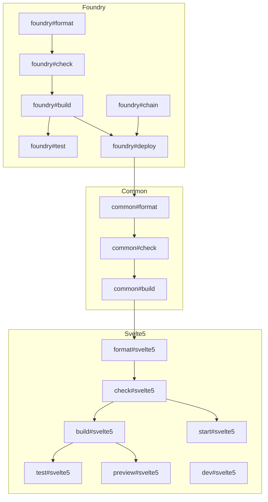

```mermaid
flowchart TD
    subgraph Foundry
        F1[foundry#format]
        F2[foundry#check]
        F3[foundry#build]
        F4[foundry#test]
        F5[foundry#chain]
        F6[foundry#deploy]
        F1 --> F2 --> F3 --> F4
        F3 --> F6
        F5 --> F6
    end

    subgraph Common
        C1[common#format]
        C2[common#check]
        C3[common#build]
        F6 --> C1 --> C2 --> C3
    end

    subgraph Svelte5
        S1[format#svelte5]
        S2[check#svelte5]
        S3[build#svelte5]
        S4[test#svelte5]
        S5[preview#svelte5]
        S6[start#svelte5]
        S7[dev#svelte5]
        C3 --> S1 --> S2 --> S3 --> S4
        S2 --> S6
        S3 --> S5
    end
```